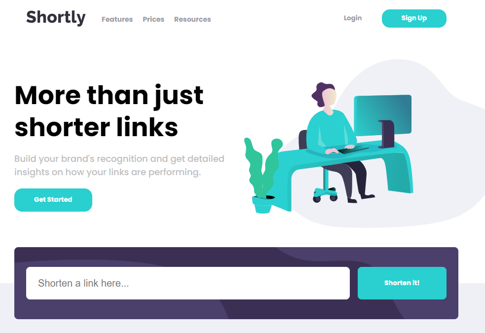

# Frontend Mentor - Shortly URL shortening API Challenge solution

This is a solution to the [Shortly URL shortening API Challenge challenge on Frontend Mentor](https://www.frontendmentor.io/challenges/url-shortening-api-landing-page-2ce3ob-G). Frontend Mentor challenges help you improve your coding skills by building realistic projects. 

## Table of contents

- [Overview](#overview)
  - [The challenge](#the-challenge)
  - [Screenshot](#screenshot)
  - [Links](#links)
- [Built with](#built-with)
- [Author](#author)

## Overview

### The challenge

Users should be able to:

- View the optimal layout for the site depending on their device's screen size
- Shorten any valid URL
- See a list of their shortened links, even after refreshing the browser
- Copy the shortened link to their clipboard in a single click
- Receive an error message when the `form` is submitted if:
  - The `input` field is empty

### Screenshot

### Links

- Solution URL: [GitHub source code](https://github.com/michey85/url-shortner-app)
- Live Site URL: [Add live site URL here](https://your-live-site-url.com)

## Built with

- Semantic HTML5 markup
- CSS custom properties
- Flexbox
- Mobile-first workflow
- [React](https://reactjs.org/) - JS library
- [Redux Toolkit](https://redux-toolkit.js.org/) - React state management
- [Framer Motion](https://www.framer.com/motion/) - React Animation library

## Author

- Website - [MishaNep](https://www.mishanep.com)
- Frontend Mentor - [@michey85](https://www.frontendmentor.io/profile/michey85)
- Twitter - [@pcgramota](https://www.twitter.com/pcgramota)
